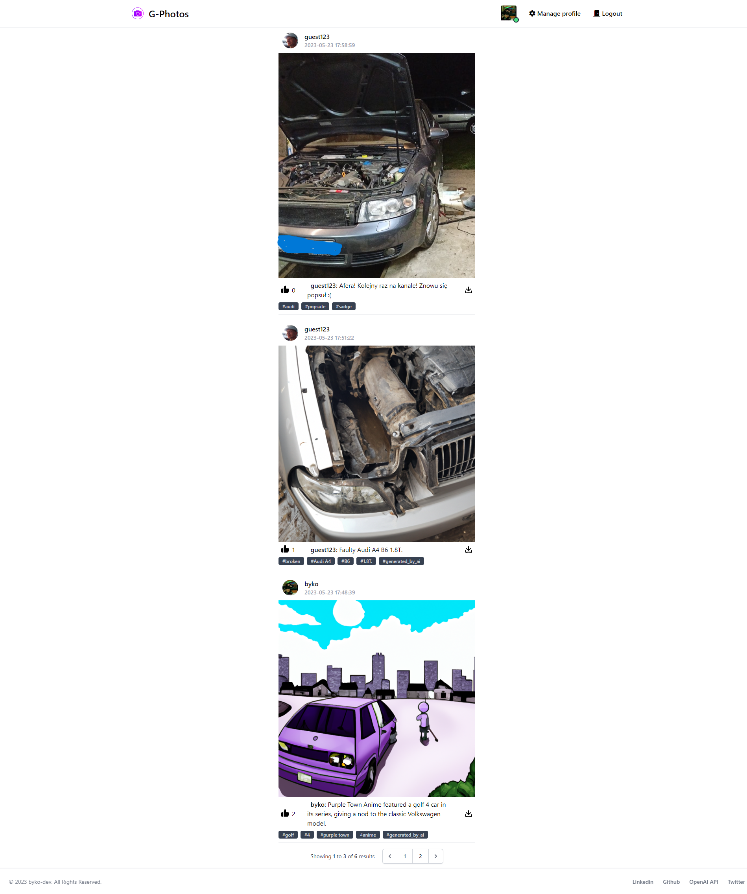
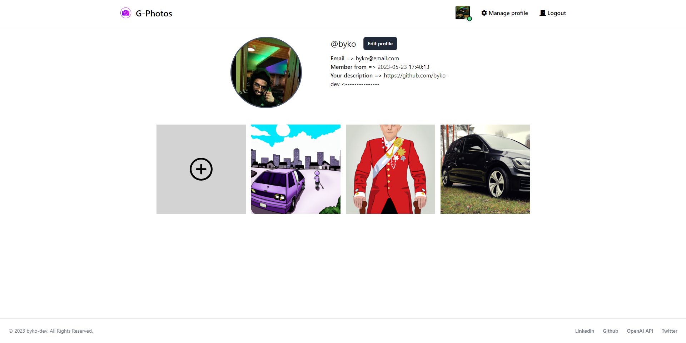
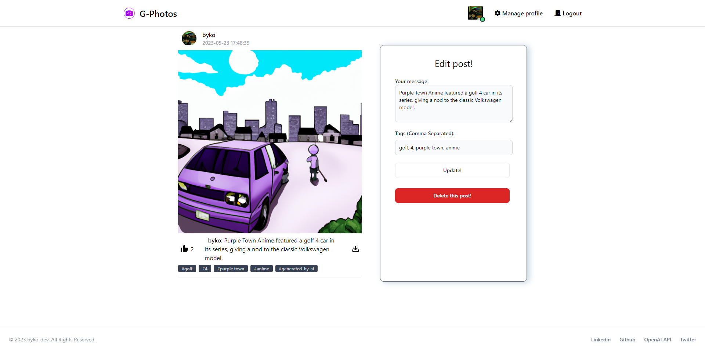
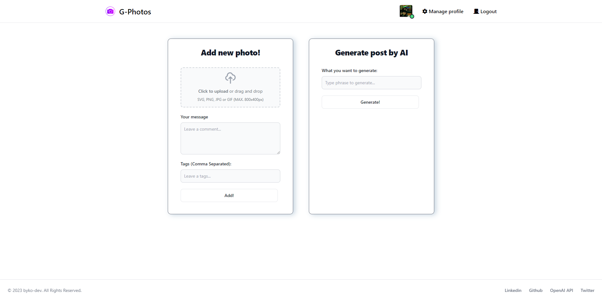

# G-Photos -> Simple instagram clone

Welcome to my Instagram clone! 📸✨

This repository showcases a Laravel-powered Instagram clone that leverages the power of artificial intelligence (AI) through OpenAI's technology to generate stunning images. The project combines the functionalities of a social media platform with advanced AI capabilities.

With this clone, users can explore an extensive collection of AI-generated photos that push the boundaries of creativity and imagination. Each image is generated using OpenAI's state-of-the-art models, resulting in unique and visually captivating content.

The Laravel framework provides the foundation for this project, ensuring a robust and scalable backend infrastructure.

### Key Features:

1. User Registration and Authentication: Users can create accounts, log in, and securely access the platform.
2. Image Generation: AI algorithms are employed to generate visually appealing and diverse images.
3. Image Gallery: Users can browse through an extensive collection of AI-generated photos.
4. Social Interactions: Users can like on images.
5. User Uploads: Users have the ability to upload their own images, expanding the diversity of the platform's content.

### Technologies used in project:

1. PHP 8.1
2. Laravel
3. Tailwind CSS / Flowbite
4. Rest-api
5. MVC
6. Docker / docker-compose

### `docker-compose.yml` file
```
version: '3.3'
services:
  db:
    image: mysql:latest
    restart: always
    environment:
      MYSQL_DATABASE: 'db'
      MYSQL_USER: 'user'
      MYSQL_PASSWORD: 'password'
      MYSQL_ROOT_PASSWORD: 'password'
    ports:
      - '3306:3306'
    expose:
      - '3306'
    volumes:
      - path:/var/lib/mysql
```

### Frontend UI photos






`Developed by byko-dev 2023`
